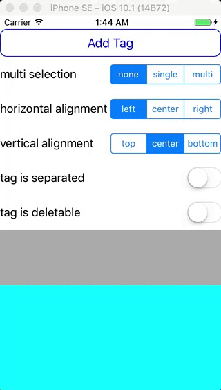

# TagList

[](https://travis-ci.org/wonderbear/TagList) [](http://cocoapods.org/pods/TagList) [](http://cocoapods.org/pods/TagList)
[](https://developer.apple.com/swift/) [](https://github.com/Carthage/Carthage) [](http://cocoapods.org/pods/TagList)

TagList, flexible tag list view, easy to use & extend. I love it.



## Contents

- [Features](#features)
- [Requirements](#requirements)
- [Demo](#demo)
- [Installation](#installation)
- [Protocols](#protocols)
- [Usage](#usage)
- [Properties](#properties & methods)
- [Author](#author)
- [License](#license)

## Features

- [x] Tag interaction
- [x] Self sizing
- [x] Easy to use
- [x] Customizable
- [x] Easy to extend

## Requirements

- iOS 8.0+ / Mac OS X 10.11+ / tvOS 9.0+
- Xcode 8.0+
- Swift 3.0+

## Installation

### CocoaPods

[CocoaPods](http://cocoapods.org) is a dependency manager for Cocoa projects. You can install it with the following command:

```bash
$ gem install cocoapods
```

To integrate TagList into your Xcode project using CocoaPods, specify it in your `Podfile`:

```ruby
source 'https://github.com/CocoaPods/Specs.git'
platform :ios, '8.0'
use_frameworks!

target '<Your Target Name>' do
    pod 'TagList', '~> 0.2.0'
end
```

Then, run the following command:

```bash
$ pod install
```

### Carthage

[Carthage](https://github.com/Carthage/Carthage) is a decentralized dependency manager that builds your dependencies and provides you with binary frameworks.

You can install Carthage with [Homebrew](http://brew.sh/) using the following command:

```bash
$ brew update
$ brew install carthage
```

To integrate TagList into your Xcode project using Carthage, specify it in your `Cartfile`:

```ogdl
github "xiongxiong/TagList" ~> 0.2.0
```

Run `carthage update` to build the framework and drag the built `TagList.framework` into your Xcode project.

### Manually

If you prefer not to use either of the aforementioned dependency managers, you can integrate TagList into your project manually.

## Demo

Open the demo project, build and run.

## Protocols

### TagListDelegate
```swift
public protocol TagListDelegate: NSObjectProtocol {

    func tagActionTriggered(tagList: TagList, action: TagAction, content: TagPresentable, index: Int)
    func tagListUpdated(tagList: TagList)
}
```

### TagPresentable
```swift
public protocol TagPresentable {

    var tag: String { get }
    var isSelected: Bool { get set }

    func createTagContent() -> TagContent
}
```

### TagActionable
```swift
public protocol TagActionable {

    var actionDelegate: TagActionDelegate? { get set }
}
```

### TagActionDelegate
```swift
public protocol TagActionDelegate: NSObjectProtocol {

    func tagActionTriggered(action: TagAction)
}
```

### TagStatable
```swift
public protocol TagStatable {

    var stateDelegate: TagStateDelegate? { get set }
}
```

### TagStateDelegate
```swift
public protocol TagStateDelegate: NSObjectProtocol {

    func tagSelected(_ isSelected: Bool)
}
```

### TagWrapperDelegate
```swift
protocol TagWrapperDelegate: TagActionable, TagActionDelegate, TagStatable, TagStateDelegate {

    func wrap(target: TagContent) -> TagWrapper
    func wrap(wrapper: TagWrapper) -> TagWrapper
}
```

## Usage

### Import SwiftTagList
```swift
import SwiftTagList
```

### Implement TagListDelegate [Optional]
```swift
extension ViewController: TagListDelegate {

    // Called when tagList's content changed
    func tagListUpdated(tagList: TagList) {
        ...
    }

    // Tag interaction
    func tagActionTriggered(tagList: TagList, action: TagAction, content: TagPresentable, index: Int) {
        ...
    }
}
```

### Initialize TagList
```swift
let view = TagList()
view.delegate = self
view.backgroundColor = UIColor.yellow
view.tagMargin = UIEdgeInsets(top: 3, left: 5, bottom: 3, right: 5)
view.separator.image = #imageLiteral(resourceName: "icon_arrow_right")
view.separator.size = CGSize(width: 16, height: 16)
view.separator.margin = UIEdgeInsets(top: 0, left: 5, bottom: 0, right: 5)
...
```

### Customizable
TagPresentableText, TagPresentableIcon & TagPresentableIconText are already implemented, you can use it straightforwardly, or you can choose to implement TagPresentable and subclass TagContent to create your own tag.

## Properties & Methods

### TagList

#### Properties
```swift
var delegate: TagListDelegate?
var tags: [Tag] = []
var horizontalAlignment: TagHorizontalAlignment = .left | .right | .center
var verticalAlignment: TagVerticalAlignment = .left | .right | .center
var tagMargin = UIEdgeInsets(top: 3, left: 3, bottom: 3, right: 3)
var separator: SeparatorInfo = SeparatorInfo()
var isSeparatorEnabled = false
var isAutowrap = true
var selectionMode: TagSelectionMode = .none | .single | .multiple
```

#### Manage tags
```swift
func tagPresentables() -> [TagPresentable]
func selectedTagPresentables() -> [TagPresentable]
```

#### Example
```swift
let tag = Tag(content: TagPresentableText("...") {
            $0.label.font = UIFont.systemFont(ofSize: 16)
            }, onInit: {
                $0.padding = UIEdgeInsets(top: 8, left: 10, bottom: 8, right: 10)
                $0.layer.borderColor = UIColor.cyan.cgColor
                $0.layer.borderWidth = 2
                $0.layer.cornerRadius = 5
            }, onSelect: {
            $0.backgroundColor = $0.isSelected ? UIColor.orange : UIColor.white
        })
tag.wrappers = [TagWrapperRemover(onInit: {
                    $0.deleteButton.setImage(UIImage(named: "icon_delete")).withRenderingMode(.alwaysTemplate), for: .normal)
                    $0.space = 8
                }) {
                    $0.deleteButton.tintColor = $1 ? UIColor.white : UIColor.black
              }]
tagList.tags.append(tag)
```

### Tag

#### Initialization
```swift
init(content: TagPresentable, onInit: ((Tag) -> Void)? = nil, onSelect: ((Tag) -> Void)? = nil)
```

#### Properties
```swift
var content: TagPresentable { get }
var wrappers: [TagWrapper] = []
var padding: UIEdgeInsets = UIEdgeInsets(top: 3, left: 3, bottom: 3, right: 3)
var isSelected: Bool
```

### TagPresentableText
```swift
init(_ tag: String, onContentInit: ((TagContentText) -> Void)? = nil)
```

### TagPresentableIcon
```swift
init(_ tag: String, icon: String, onContentInit: ((TagContentIcon) -> Void)? = nil)
```

### TagPresentableIconText
```swift
init(_ tag: String, icon: String, onContentInit: ((TagContentIconText) -> Void)? = nil)
```

### TagWrapperRemover
```swift
init(onInit: ((TagWrapperRemover) -> Void)? = nil, onSelect: ((TagWrapperRemover, Bool) -> Void)? = nil)
```

## Author

xiongxiong, ximengwuheng@163.com

## License

TagList is available under the MIT license. See the LICENSE file for more info.
